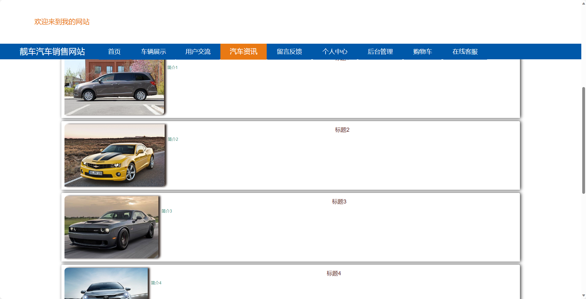

<h1 align="center">基于SpringBoot框架实现的靓车汽车销售网站【带文档】</h1>

<h4> 完整代码获取地址：从戎源码网（https://armycodes.com/） </h4>
<h4> 作者微信：19941326836 QQ：605739993 QQ群：655392706 </h4>
<h4> 承接计算机毕设、Java毕业设计、Python毕业设计、深度学习、机器学习 </h4>
<h4> 选题+开题报告+任务书+程序定制+安装调试+论文+答辩ppt 一条龙服务 </h4>
<h4> 毕业设计所有选题地址：(https://github.com/Descartes007/allProject) </h4>

## 项目介绍

基于SpringBoot框架实现的靓车汽车销售网站【带文档】：前端 vue、axios、elementui，后端 springboot、mybatis，系统角色分为：管理员和用户，管理员在管理后台对用户信息、车辆品牌、维修材料信息、用户交流内容进行管理等；用户可以维修车辆、反馈车辆情况等。主要功能如下：

## 【前台】

- 首页：展示网站的概要信息和推荐车辆。
- 车辆展示：展示可供销售的汽车。
- 用户交流：提供用户之间的交流平台。
- 汽车资讯：提供关于汽车行业的最新资讯和相关文章。
- 留言反馈：用户可以留下对于网站或车辆的反馈和建议。
- 个人中心：用户可以管理个人信息、查看订单状态以及管理个人收藏。

## 【后台】
### 用户

- 个人中心：用户可以管理个人信息和修改密码等。
- 留言板管理：管理员可以管理用户留言的审核和回复。
- 我的收藏管理：用户可以查看和管理自己收藏的车辆信息。
- 购物车：用户可以将感兴趣的车辆加入购物车并进行管理。
- 在线客服：提供在线客服支持。

### 管理员

- 个人中心：管理员可以管理个人信息和修改密码等。
- 用户管理：管理员可以对用户进行管理，
- 车辆展示管理：管理员可以管理车辆的展示信息，
- 车辆品牌管理：管理员可以管理车辆品牌的信息，
- 车辆型号管理：管理员可以管理车辆型号的信息，
- 维修材料管理：管理员可以管理维修材料的信息，
- 材料分类管理：管理员可以管理材料的分类信息，
- 用户交流留言板管理：管理员可以管理用户之间交流的留言板，。
- 系统管理：管理员可以管理系统的基本设置，
- 订单管理：管理员可以管理用户的订单信息，

## 环境

- <b>IntelliJ IDEA 2020.3</b>

- <b>Mysql 5.7.26</b>

- <b>Maven 3.6.3</b>

- <b>JDK 1.8</b>

## 运行截图

